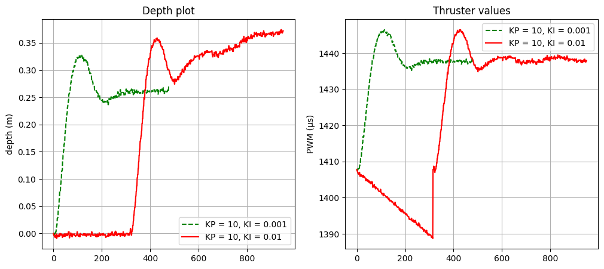
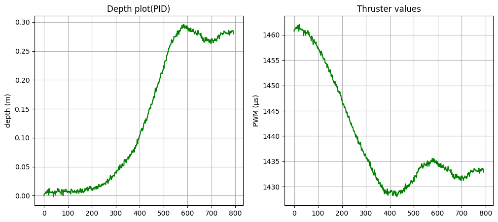
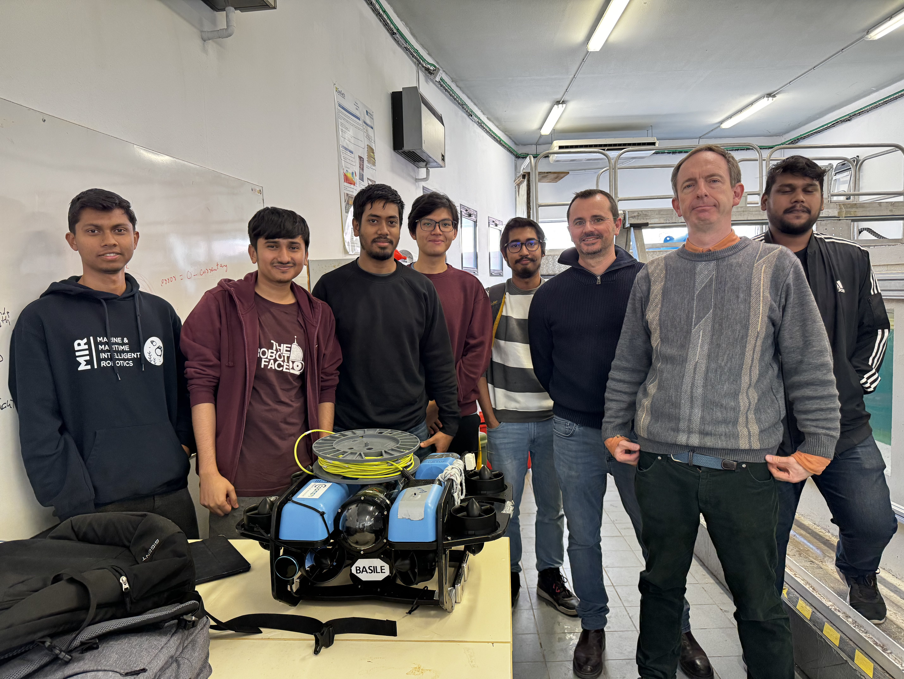

# BlueROV Control Systems Implementation

## Overview
This repository contains the code and experimental results from practical work conducted on the BlueROV within the COSMER Lab water tank at the University of Toulon. The project aimed to implement and evaluate different control strategies, ranging from Proportional (P) to Proportional Integral Derivative (PID) controllers, including trajectory generation and disturbance handling. The work was carried out under the supervision of Prof. Vincent Hugel from the University of Toulon and Prof. Vincent Creuze from the University of Montpellier.

## Table of Contents
- [Introduction](#introduction)
- [Setup](#setup)
- [Experiments](#experiments)
- [Results](#results)
- [Conclusion](#conclusion)
- [Acknowledgments](#acknowledgments)

## Introduction
The BlueROV is an open-source underwater vehicle designed for researchers and hobbyists alike. Controlling such a vehicle poses unique challenges due to the fluid dynamics and external disturbances present in an underwater environment. This repository documents our approach to implementing various control strategies to manage these challenges effectively.

## Setup
- **Hardware**: BlueROV platform with integrated sensors and thrusters.
- **Environment**: COSMER Lab water tank, University of Toulon.
- **Control Algorithms**: Implemented in Python/C++ (as applicable).
- 
### ROS and Dependencies Installation
For Ubuntu 18.04 with ROS Melodic (replace `melodic` with `noetic` for Ubuntu 20.04 and `python` with `python3`):
```bash
sudo apt-get install -y cmake python-catkin-pkg python-empy python-nose python-setuptools libgtest-dev build-essential openssh-server
sudo apt-get install python-wstool python-rosinstall-generator python-catkin-tools
sudo apt-get install ros-melodic-joy
mkdir -p ~/catkin_ws/src
cd ~/catkin_ws
catkin init
```

### MAVROS Installation
- **Local Installation** (recommended): Copy the `autonomous_rov`, `mavros`, and `mavlink` packages provided in the TGZ files into `~/catkin_ws/src`.

  Then build the packages:
  ```bash
  catkin build
  # For verbose output or if encountering issues, use:
  catkin build -j1 -v
  ```

- **Network Installation**: Alternatively, you can install MAVROS from the network, but ensure compatibility with the embedded version on BlueROV.
  ```bash
  cd ~/catkin_ws
  catkin init
  wstool init ~/catkin_ws/src
  rosinstall_generator --upstream mavros | tee /tmp/mavros.rosinstall
  rosinstall_generator mavlink | tee -a /tmp/mavros.rosinstall
  wstool merge -t src /tmp/mavros.rosinstall
  wstool update -t src
  rosdep install --from-paths src --ignore-src --rosdistro melodic -y # Replace 'melodic' with 'noetic' for Ubuntu 20.04
  ```

### Modifying `OverrideRCIn.msg`
For compatibility, modify the `OverrideRCIn.msg` in `~/catkin_ws/src/mavros/mavros_msgs` as follows:
- Change `uint16[18] channels` to `uint16[8] channels`.
## Experiments
- **P Controllers**: Initial implementation of proportional control for depth and yaw.
- **PI Controllers**: Integration of the integral component to mitigate steady-state errors.
- **PID Controllers**: Incorporation of the derivative component for predictive control.
- **Trajectory Generation**: Designing trajectories that consider the ROV's dynamics.
- **Disturbance Handling**: Testing the robustness of control systems against manual disturbances.
- **Filtering**: Using an alpha-beta filter to estimate the heave from depth measurements.

## Results
Results from each experiment, including plots and observations, are located in the `results` folder. The data includes depth and yaw control responses, robustness to disturbances, and the effectiveness of the alpha-beta filter.
<div style="display:flex;">
  <figure style="margin-right: 20px;">
    
    <figcaption>Figure 1: PI Controller for depth and floatability compensation.</figcaption>
  </figure>
  <figure>
    
    <figcaption>Figure 2: PID Controllers with Floatability Compensation.</figcaption>
  </figure>
</div>


## Conclusion
The practical work has provided valuable insights into the control of underwater vehicles. Each control strategy was dissected and understood through a series of methodical experiments, revealing both the potential and limitations of the controllers within the context of underwater navigation and stability.

## Acknowledgments
Special thanks to Prof. Vincent Hugel and Prof. Vincent Creuze for their guidance and supervision throughout this project. Their expertise in the field has been invaluable to the success of this practical work.

## How to Use This Repository
Detailed instructions on how to run the experiments and analyze the results can be found in the [Documentation](/Documentation).

## License
This project is open-source and available under the [MIT License](LICENSE).

## Contact
- **Student**: 
  - Md Ether Deowan 
  - Md Shamin Yeasher Yousha 
  - Shahriar Hassan 
  - Tihan Mahmud Hossain 
  - Akshat Sinha 
  - Krittapat Onthuam 
- **Supervisors**: 
  - Prof. Vincent Hugel 
  - Prof. Vincent Creuze

<div style="display:flex;">
    
</div>